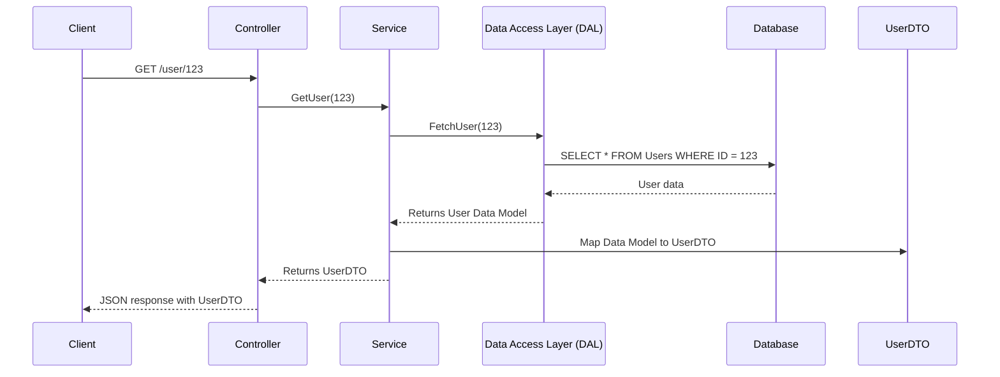
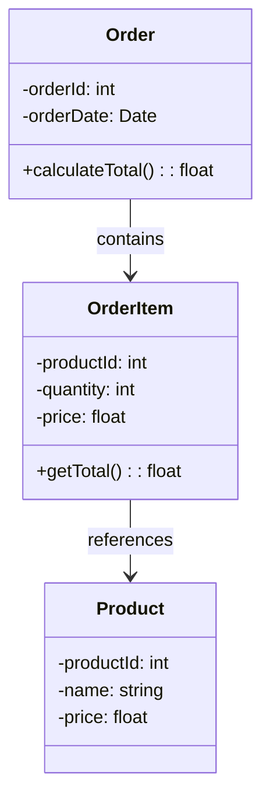
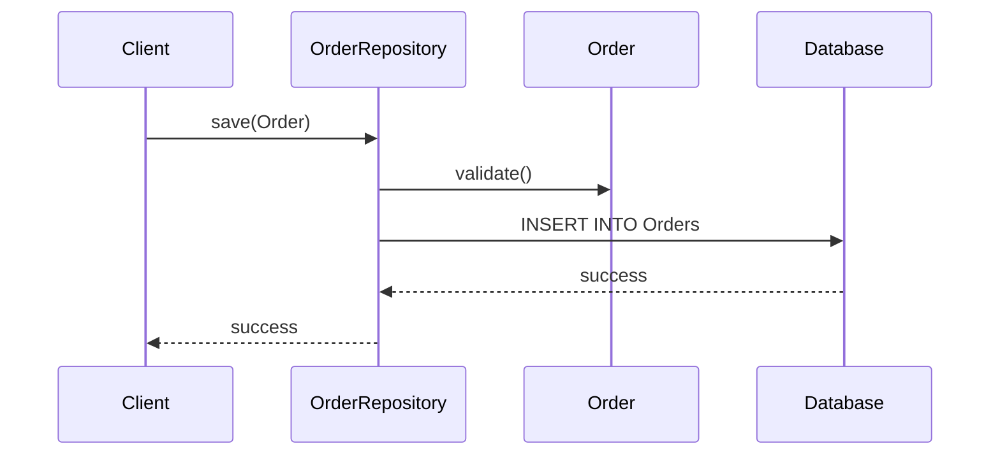

# Domain-Driven Design (DDD)

Domain-Driven Design (DDD) is a software development approach that focuses on modeling software to match a domain according to input from that domain's experts. It aims to create a shared understanding of the domain and improve communication between technical and non-technical stakeholders.

## Why Use Domain-Driven Design?

- **Complex Domains**: DDD is particularly useful for complex domains where understanding and managing the domain logic is crucial.
- **Alignment**: It ensures that the software model aligns closely with the business domain, leading to more accurate and effective solutions.
- **Communication**: Improves communication between developers and domain experts by using a common language (Ubiquitous Language).
- **Flexibility**: Facilitates adaptability and flexibility in the software design, making it easier to accommodate changes in the business requirements.

## When to Use Domain-Driven Design?

- **Complex Business Logic**: When the project involves complex business rules and logic that need to be accurately represented in the software.
- **Long-Term Projects**: For long-term projects where maintaining and evolving the software is critical.
- **Collaborative Environments**: In environments where close collaboration between developers and domain experts is possible and necessary.

## Pros and Cons

### Pros

- **Improved Communication**: Establishes a common language between developers and domain experts.
- **Better Alignment**: Ensures the software design closely matches the business domain.
- **Enhanced Flexibility**: Makes it easier to adapt to changes in business requirements.
- **Focused Development**: Encourages a focus on the core domain and its complexities.

### Cons

- **Learning Curve**: Can have a steep learning curve for developers new to the approach.
- **Time-Consuming**: Initial modeling and design can be time-consuming.
- **Requires Collaboration**: Needs active collaboration between developers and domain experts, which may not always be feasible.

# DTO (Data transfer object)

## Sequence Diagram

The following sequence diagram illustrates the process of fetching user data:

This diagram shows the interaction between the client, controller, service, data access layer, database, and the data transfer object (DTO) when a client requests user data.

## Aggregates

Aggregates are clusters of domain objects that can be treated as a single unit. An aggregate will have one of its component objects be the aggregate root. Any references from outside the aggregate should only go to the aggregate root. The root can ensure the integrity of the aggregate as a whole.

### Example Diagram

The following diagram illustrates the relationship between an aggregate root and its entities:

In this example, `Order` is the aggregate root, and it contains `OrderItem` entities. Each `OrderItem` references a `Product`.

## Repositories

Repositories are used to encapsulate the logic required to access data sources. They provide a collection-like interface for accessing domain objects.

### Example Diagram

The following diagram illustrates the interaction between a repository and the domain model:

This diagram shows how a client interacts with the `OrderRepository` to save an `Order` object to the database.
