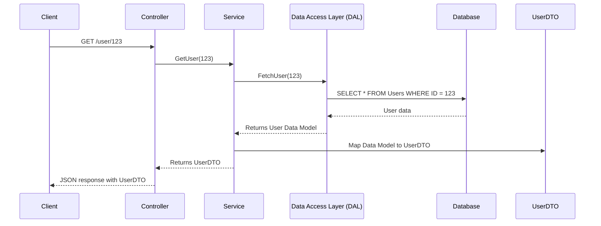

# DTO (Data transfer object)

## Sequence Diagram

The following sequence diagram illustrates the process of fetching user data:

This diagram shows the interaction between the client, controller, service, data access layer, database, and the data transfer object (DTO) when a client requests user data.
