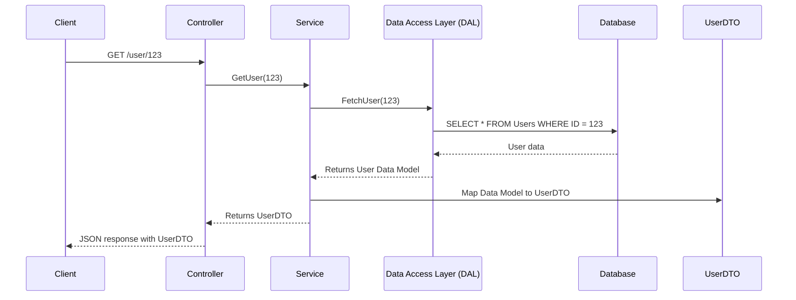
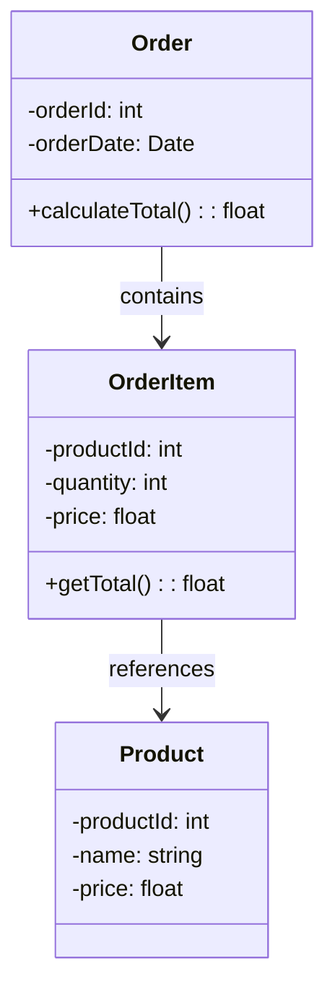
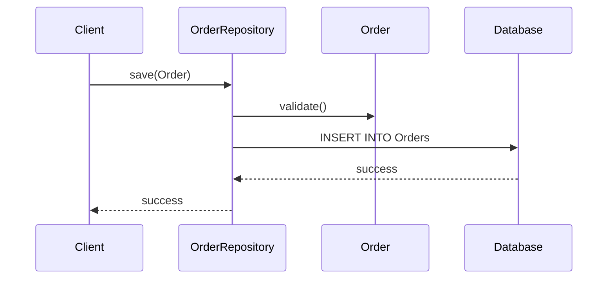

# DTO (Data transfer object)

## Sequence Diagram

The following sequence diagram illustrates the process of fetching user data:

This diagram shows the interaction between the client, controller, service, data access layer, database, and the data transfer object (DTO) when a client requests user data.
## Aggregates

Aggregates are clusters of domain objects that can be treated as a single unit. An aggregate will have one of its component objects be the aggregate root. Any references from outside the aggregate should only go to the aggregate root. The root can ensure the integrity of the aggregate as a whole.

### Example Diagram

The following diagram illustrates the relationship between an aggregate root and its entities:

In this example, `Order` is the aggregate root, and it contains `OrderItem` entities. Each `OrderItem` references a `Product`.

## Repositories

Repositories are used to encapsulate the logic required to access data sources. They provide a collection-like interface for accessing domain objects.

### Example Diagram

The following diagram illustrates the interaction between a repository and the domain model:

This diagram shows how a client interacts with the `OrderRepository` to save an `Order` object to the database.